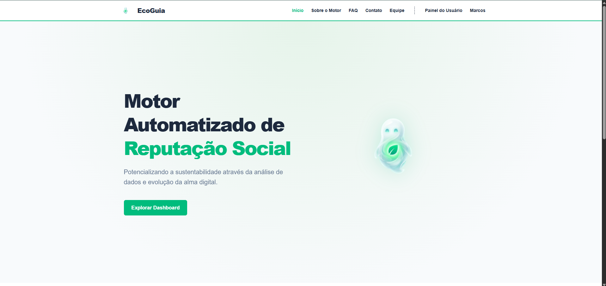
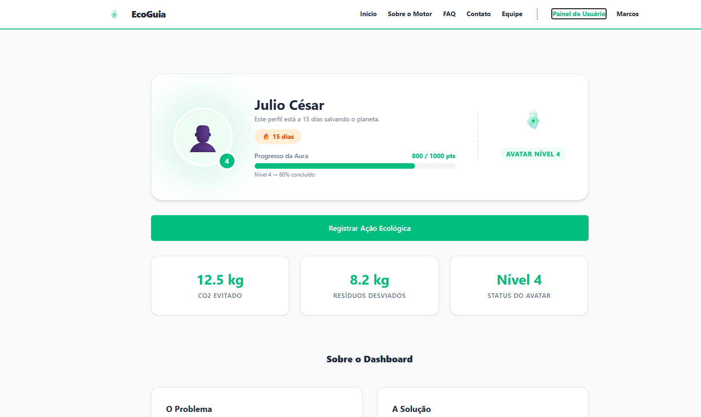
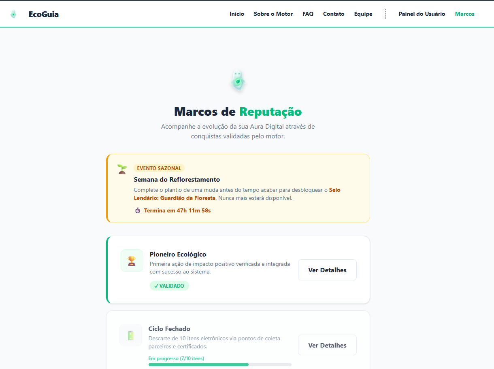

# EcoGuia - Motor de Reputação SoulUp

O **EcoGuia** é uma aplicação Single Page Application (SPA) desenvolvida para centralizar, auditar e comprovar o histórico de ações ecológicas dos usuários através de um **Motor de Reputação Social** gamificado, a *Aura Digital*. Esta entrega representa a **SPRINT 03 - Front-End Design Engineering**.

## 🛠️ Tecnologias Utilizadas

O projeto foi construído seguindo os padrões mais modernos do mercado e com as tecnologias obrigatórias estipuladas pela disciplina:

- **React 19** (Interface e Componentização)
- **Vite** (Ferramenta de Build ultra-rápida)
- **TypeScript** (Tipagem estática para robustez e redução de erros)
- **Tailwind CSS v4** (Estilização responsiva e utility-first)
- **React Router DOM** (Roteamento dinâmico SPA)
- **React Hook Form** (Validação e gerenciamento avançado de formulários)

## 📁 Estrutura de Pastas do Projeto

O projeto foi modularizado utilizando as melhores práticas do ecossistema React:

```text
📦 ecoguia-react
 ┣ 📂 public               # Assets estáticos (Favicon)
 ┣ 📂 src
 ┃ ┣ 📂 assets             # Imagens ilustrativas (ex: alma.png, fotos do time)
 ┃ ┣ 📂 components         # Componentes React REUTILIZÁVEIS (Header, Footer, Button, Card)
 ┃ ┣ 📂 context            # Gerenciamento de Estado via Context API (UserContext)
 ┃ ┣ 📂 pages              # Páginas da SPA (Home, Sobre, Marcos, Dashboard, Contato, etc)
 ┃ ┣ 📜 App.tsx            # Ponto de configuração de Rotas (react-router-dom)
 ┃ ┣ 📜 index.css          # Estilização global mínima
 ┃ ┣ 📜 main.tsx           # Ponto de entrada (Entry Point) da aplicação React
 ┃ ┗ 📜 types.ts           # Interfaces globais do TypeScript
 ┣ 📜 package.json         # Manifesto do projeto e dependências
 ┣ 📜 tsconfig.json        # Configuração do TypeScript
 ┗ 📜 vite.config.ts       # Configurações do empacotador Vite
```

## 👨‍💻 Autores e Créditos

Equipe responsável pelo desenvolvimento do EcoGuia:

| Foto | Nome / RM / Turma | GitHub | LinkedIn |
| :---: | :--- | :--- | :--- |
|  | **Ana Paula Cunha Brum**<br>RM: 571359<br>Turma: 1º TDSR | [abbrum](https://github.com/abbrum) | [LinkedIn](https://www.linkedin.com/in/ana-paula-brum/) |
|  | **Gabriella Serni Ponzetta**<br>RM: 566296<br>Turma: 1º TDSR | [gabriellaserni](https://github.com/gabriellaserni) | [LinkedIn](https://www.linkedin.com/in/gabriellaserni/) |
|  | **Victor Felipe Silva Alencar**<br>RM: 574057<br>Turma: 1º TDSR | [alencarVictor](https://github.com/alencarVictor) | [LinkedIn](https://www.linkedin.com/in/victor-alencar-58623a3ba/) |
|  | **Julio Cesar Iwata de Oliveira Barros**<br>RM: 573723<br>Turma: 1º TDSR | [IwaataNz3](https://github.com/IwaataNz3) | [LinkedIn](https://www.linkedin.com/in/julioiwata/) |
|  | **Rafael Santos Dias**<br>RM: 574105<br>Turma: 1º TDSR | [realrafaelsd](https://github.com/realrafaelsd) | [LinkedIn](https://www.linkedin.com/in/rafaelsd/) |

## 🖼️ Imagens e Ícones do Projeto

Abaixo estão algumas demonstrações visuais da nossa aplicação:

### Alma Digital

*O avatar que evolui de acordo com suas ações ecológicas validadas pelo motor.*

### Screenshots

**Página Inicial (Home)**


**Painel do Usuário (Dashboard)**


**Trilha de Marcos**


## 🔗 Como Usar (Links Úteis)

- **Repositório do GitHub:** https://github.com/IwaataNz3/Ecoguia-React-FIAP
- **Pitch / Vídeo de Demonstração (YouTube):** [Insira o link para o vídeo no YOUTUBE aqui]

## ✉️ Contato

Caso tenha dúvidas sobre o projeto ou a arquitetura proposta:
- **E-mail Geral:** contato@ecoguia.com.br
- **Suporte Técnico:** suporte@ecoguia.com.br
